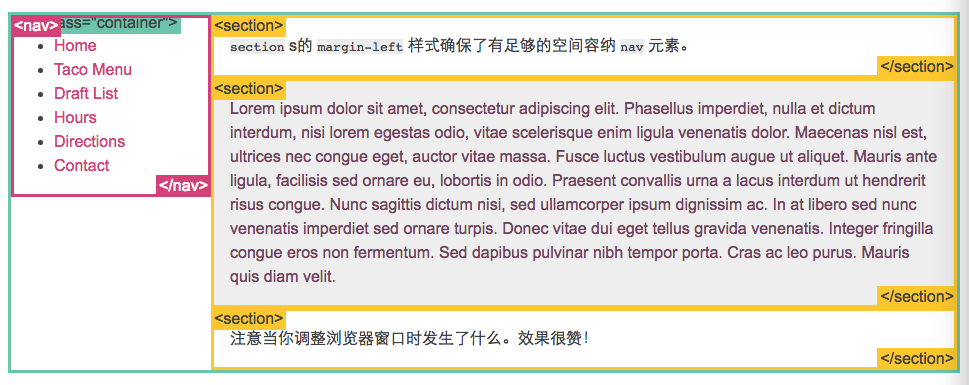
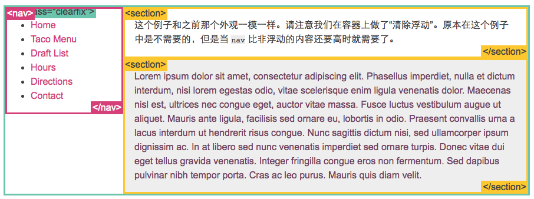
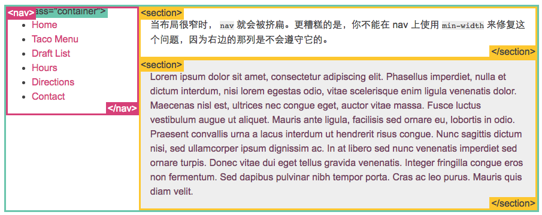
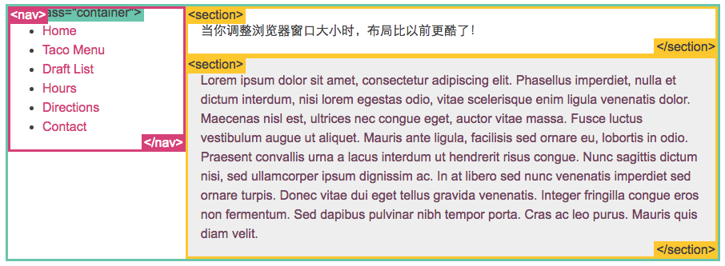
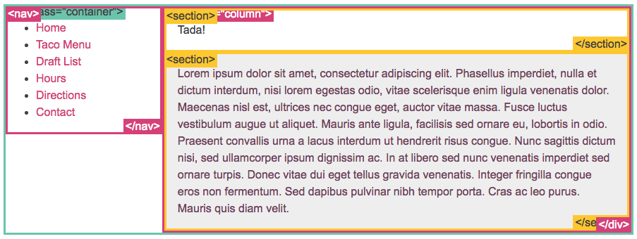
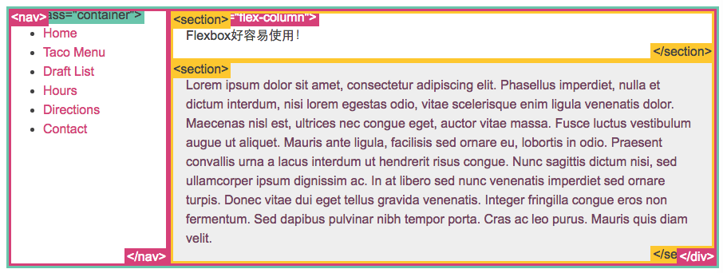

## position例子

通过具体的例子可以帮助我们更好地理解“position”。下面是一个真正的页面布局。

```
.container {
  position: relative;
}
nav {
  position: absolute;
  left: 0px;
  width: 200px;
}
section {
  /* position is static by default */
  margin-left: 200px;
}
footer {
  position: fixed;
  bottom: 0;
  left: 0;
  height: 70px;
  background-color: white;
  width: 100%;
}
body {
  margin-bottom: 120px;
}
```



## 浮动布局例子

完全使用 `float` 来实现页面的布局是很常见的。这里有一个我之前用 `position` 实现的布局例子，这次我使用 `float` 实现了它。

```
nav {
  float: left;
  width: 200px;
}
section {
  margin-left: 200px;
}
```



## 百分比宽度

百分比是一种相对于包含块的计量单位。它对图片很有用：如下我们实现了图片宽度始终是容器宽度的50%。把页面缩小看下效果！

```
article img {
  float: right;
  width: 50%;
}
```



## 媒体查询

“响应式设计（Responsive Design）”是一种让网站针对不同的浏览器和设备“响应”不同显示效果的策略，这样可以让网站在任何情况下显示的很棒！

媒体查询是做此事所需的最强大的工具。让我们使用百分比宽度来布局，然后在浏览器变窄到无法容纳侧边栏中的菜单时，把布局显示成一列：

```
@media screen and (min-width:600px) {
  nav {
    float: left;
    width: 25%;
  }
  section {
    margin-left: 25%;
  }
}
@media screen and (max-width:599px) {
  nav li {
    display: inline;
  }
}
```



## inline-block 布局

你可以使用 `inline-block` 来布局。有一些事情需要你牢记：

- `vertical-align` 属性会影响到 `inline-block` 元素，你可能会把它的值设置为`top` 。
- 你需要设置每一列的宽度
- 如果HTML源代码中元素之间有空格，那么列与列之间会产生空隙

```
nav {
  display: inline-block;
  vertical-align: top;
  width: 25%;
}
.column {
  display: inline-block;
  vertical-align: top;
  width: 75%;
}
```



## flexbox

新的 `flexbox` 布局模式被用来重新定义CSS中的布局方式。很遗憾的是最近规范变动过多，导致各个浏览器对它的实现也有所不同。不过我仍旧想要分享一些例子，来让你知道即将发生的改变。这些例子目前只能在支持 flexbox 的 Chrome 浏览器中运行，基于[最新的标准](http://www.w3.org/TR/css3-flexbox/)。

网上有不少过时的 flexbox 资料。 如果你想要了解更多有关 flexbox 的内容，[从这里](http://css-tricks.com/old-flexbox-and-new-flexbox/)学习如何辨别一份资料是否过时。我已经写了一份[关于最新标准的详细文章](http://weblog.bocoup.com/dive-into-flexbox/)。

使用flexbox你还可以做的更多；这里只是一些让你了解概念的例子：

使用 Flexbox 的简单布局

```
.container {
  display: -webkit-flex;
  display: flex;
}
nav {
  width: 200px;
}
.flex-column {
  -webkit-flex: 1;
          flex: 1;
}
```

